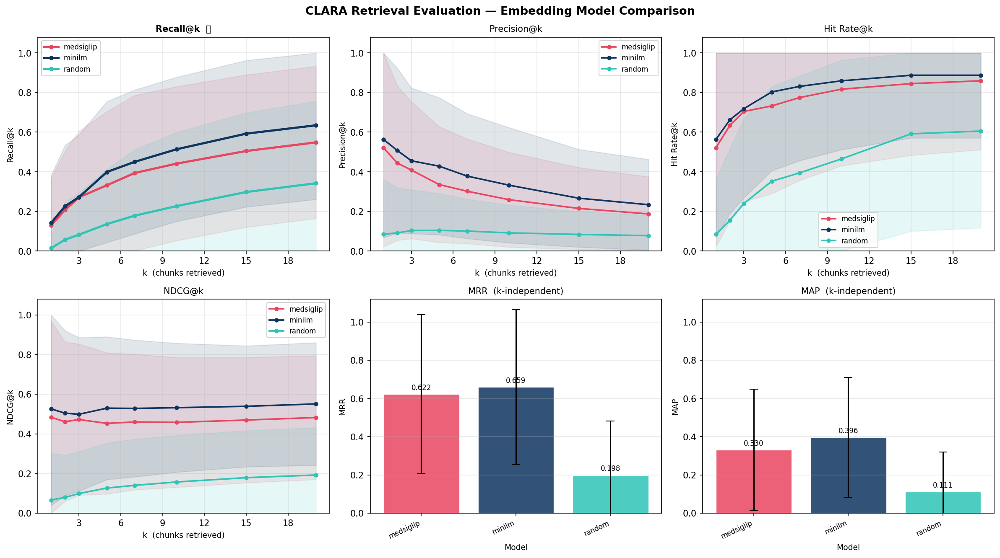

### Project Name

**CLARA (CLinical Audit & Regulation Assistant)** is an agentic platform to automate the regulatory cross-examination of clinical trial protocols, ensuring alignment with federal regulations and global ethical standards.

### Team

**Justin Zeng** ([LinkedIn](https://www.linkedin.com/in/justin-zeng/)) — Academic experience in bioinformatics and data science; currently a researcher at Columbia's Irving Medical Center. Justin identified the core medical components and built the agentic workflow process to emulate clinical trial protocol review processes. 

**Kennard Mah** ([LinkedIn](https://www.linkedin.com/in/kennardmah/)) — Academic experience in human-centered design engineering and data science. Kennard aligned the workflow with human-centered design principles, bridging the technical architecture with practical clinical applications.

Both Justin and Kennard contributed to the codebase, UI/UX design, and research into current clinical processes to identify high-impact areas for AI integration.

### Problem Statement

Every clinical trial must undergo regulatory cross-examination — a labor-intensive process where protocol documents are scrutinized against federal regulations (e.g., 21 CFR Parts 50, 56, 312, and 812), ICH-GCP guidelines (E6(R2)), and institutional ethical standards. This process is the critical bottleneck in the clinical trial pipeline:

1. **Manual and repetitive:** Regulatory specialists must cross-reference dense protocol language against hundreds of pages of federal regulation, a process that is error-prone and requires lots of time.
2. **Subject matter specialization:** The task demands deep domain expertise in both clinical medicine and regulatory law, a very specialized combination of skills.
3. **High-impact:** A single oversight — a missing informed consent clause, an inadequate adverse event reporting plan, or a non-compliant inclusion/exclusion criterion — can result in FDA clinical holds, IRB rejections, or costly protocol amendments that delay trials by months.

At the core of AI and data science, we believe the highest impact lies in solving repetitive tasks that require specialized, subject matter expertise — efficiently tackling the bottleneck regulation work that obstruct researchers from scientific innovation.

#### Impact Potential

There is strong impact potential in terms of automating clinical trial protocol reviews:

- **Over 300,000 clinical trials** are registered globally at any given time (ClinicalTrials.gov), each requiring regulatory review.
- The average Phase III trial costs **$11.5M–$52.9M**, with regulatory delays adding an estimated **$37,000 per day** in opportunity costs (Tufts CSDD).
- **~80% of clinical trials** experience delays, with regulatory and IRB review being a leading contributor.
- Protocol amendments, often triggered by regulatory non-compliance discovered late, occur in **57% of trials** and cost an average of **$535,000 per amendment** (Tufts CSDD).

By automating regulatory cross-examination, CLARA can significantly reduce review cycle times from weeks to minutes, catch compliance gaps before submission, and free clinical practicians to focus on research rather than line-by-line cross-referencing.

### Overall Solution

CLARA employs a Retrieval-Augmented Generation (RAG) pipeline with an agentic multi-step workflow that mirrors how a human regulatory specialist reviews a clinical trial protocol.

Clinical trial protocols use highly specialized language — phrases like *"serious adverse event reporting within 24 hours"*, *"informed consent per 21 CFR 50.25"*, or *"IND safety reports per 312.32"* — that carry precise regulatory meaning. Rather than fine-tuning a model (which risks hallucination on regulatory citations), we built a RAG pipeline that grounds every assessment in retrieved regulatory text, ensuring traceability and auditability — a non-negotiable requirement in regulated industries.

#### Domain-Sensitive Embeddings and Retrieval Precision

The quality of a RAG system depends critically on its embedding model: the model that converts regulation text and protocol queries into vector representations for semantic search. We evaluated two approaches — a general-purpose sentence embedding model and HAI-DEF's MedSigLIP — to determine which produces higher-quality retrieval for regulatory cross-examination.

**MedSigLIP** is a contrastive vision-language model from the HAI-DEF suite, built on the SigLIP architecture and fine-tuned on medical data. It provides both a vision encoder and a text encoder trained jointly to align medical images with their textual descriptions. We adapted MedSigLIP's text encoder as an embedding function for our vector store, hypothesizing that its exposure to medical terminology during training would yield better semantic representations of regulatory language compared to general-purpose models. The analysis of the model and comparison with other tools is discussed in the Product Feasibility section, where we found that despite using MedSigLIP for its HAI-DEF specialization, other text-specialized models outperform on retrieval metrics.

#### Generative Cross-Examination

MedGemma 1.5 4B-IT, deployed on Google Cloud Vertex AI, powers the compliance assessment. It synthesizes retrieved regulatory passages with protocol content to produce structured, citation-backed compliance reports. MedGemma was selected for its medical domain training, which enables it to interpret clinical terminology, recognize regulatory language patterns, and reason about compliance gaps — capabilities that general-purpose LLMs often lack in this specialized context.

The platform implements a stateful workflow using LangGraph, orchestrating retrieval and audit stages in a directed graph:

```
Protocol Upload → Text Extraction → Regulation Retrieval (RAG) → Compliance Audit (MedGemma) → Structured Report
  ┌─────────────────────────────────────────────────────────────────┐
  │  Stage 1: Regulatory Retrieval                                  │
  │  Embeds protocol text, queries ChromaDB with metadata filters   │
  │  to retrieve relevant CFR sections for selected regulations     │
  ├─────────────────────────────────────────────────────────────────┤
  │  Stage 2: Compliance Assessment & Gap Analysis                  │
  │  MedGemma cross-examines protocol against retrieved regulations │
  │  and produces per-regulation pass/warning/critical findings     │
  │  with specific gaps and remediation recommendations             │
  └─────────────────────────────────────────────────────────────────┘
```

Each stage operates with a defined scope and passes structured state to the next, ensuring deterministic, auditable reasoning chains rather than a single monolithic LLM call.


### Technical Details

The technical details will cover the technology stack, product feasibility through understanding how users interact with CLARA, and how the tool is evaluated to ensure continuous improvement and high-quality performance.

#### Technology Stack

| Component | Technology | Purpose |
|---|---|---|
| **Frontend** | React | Interactive web interface for protocol upload and report viewing |
| **Orchestration** | LangGraph + LangChain | Multi-agent workflow with stateful graph execution |
| **Vector Store** | ChromaDB (persistent) | Stores embeddings of regulatory documents for semantic retrieval |
| **Embeddings** | MedSigLIP / all-MiniLM-L6-v2 / EmbeddingGemma | Domain-aware and general-purpose vector representations |
| **LLM** | MedGemma 1.5 4B-IT (Vertex AI) | Powers compliance reasoning and report generation |
| **Document Processing** | PyPDF / custom parsers | Extracts and chunks clinical trial protocols and regulatory PDFs |
| **Language** | Python 3.11+ | Core application logic |

#### How Do Users Interact with This Tool

1. **Upload:** A clinical researcher or regulatory specialist uploads their clinical trial protocol (PDF) through the web interface.
2. **Configure:** The user selects which regulatory frameworks to cross-examine against (e.g., FDA 21 CFR, ICH-GCP E6(R2), specific institutional requirements).
3. **Review:** The platform processes the document through its agentic pipeline and returns a structured compliance report with:
   - By-Regulation compliance status (Compliant / Non-Compliant / Needs Review)
   - Specific regulatory citations for each finding
   - Gap analysis identifying missing required elements
   - Actionable recommendations for remediation
4. **Iterate:** Researchers can modify their protocol and re-upload for continuous compliance checking, creating a tight feedback loop before formal IRB/FDA submission.

#### What This Tool Accomplishes

CLARA serves as an AI-powered regulatory reviewer that:

- Reduces review time from days/weeks to minutes for initial compliance screening
- Democratizes regulatory expertise**by making federal regulation accessible to researchers without deep regulatory training
- Improves protocol quality through iterative, instant feedback before formal submission
- Maintains auditability by grounding every finding in specific, cited regulatory text — never hallucinated compliance claims

Acknowledging that a "positive" result means a protocol section is deemed compliant, we optimized for high precision score (i.e., minimizing cases where the system incorrectly marks a non-compliant section as compliant.) The downstream cost of a false positive (missed non-compliance reaching FDA/IRB review) far exceeds the cost of a false negative (flagging a compliant section for human review).

This asymmetric cost function informed our design decisions:

- Conservative retrieval: We retrieve a broader set of regulatory passages (higher recall) to reduce the chance of missing a relevant regulation.
- Structured output parsing: Agents output structured JSON assessments with explicit compliance rationale, enabling human reviewers to quickly verify flagged items.
- Human-in-the-loop feedback-driven design: The tool is designed as a decision-support system, not a decision-making system. While this tool will provide recommendations, the tracability ensures that final compliance determinations rest with qualified human reviewers.

#### Product Feasibility

CLARA does not fine-tune foundation models. Instead, we adapt pre-trained models through architecture-level integration and structured prompt engineering — an intentional decision that preserves model provenance, avoids the regulatory burden of validating a custom-trained model, and enables rapid model swaps as the ecosystem evolves.

**MedGemma 1.5 4B-IT** is deployed on Vertex AI via Model Garden's one-click vLLM serving (NVIDIA RTX PRO 6000 GPU, `europe-west4`). We wrap it in a custom LangChain `LLM` class (`MedGemmaVertexLLM`) that injects a system prompt establishing the model's role as a Senior FDA Regulatory Auditor. Rather than relying on the model's free-form generation, we engineered a structured output prompt that constrains MedGemma to produce a JSON array with one object per regulation — each containing `status` (pass/warning/critical), `gaps`, and `remediation` fields. This structured prompting approach transforms MedGemma from a general medical chatbot into a regulation-specific auditor without weight modification.

Because small language models (4B parameters) frequently produce malformed JSON, we built a multi-stage output parser with four fallback levels: (1) direct JSON parse, (2) regex extraction of the outermost `[...]` array, (3) individual `{...}` object collection, and (4) free-text keyword extraction that infers compliance status from surrounding language. A deduplication pass then merges multiple objects for the same regulation by preserving the worst-case status. This defensive parsing pipeline ensures the frontend always receives valid, structured audit data regardless of model output quality.

**MedSigLIP's text encoder** was adapted as a LangChain `Embeddings` wrapper (`MedSigLIPTextEmbeddings`). SigLIP's text tower produces 768-dimensional L2-normalized embeddings, which we feed directly into ChromaDB's default cosine similarity index. Embedding is performed in batches of 64 to avoid OOM on the ~1,436 regulation chunks, with `max_length=64` to respect SigLIP's positional embedding limit. However, given the results of our analysis in the retrieval performance, we do believe that a lighter model, such as MiniLM and EmbeddingGemma, can outperform its retrieval and improve with fine-tuning. 

##### Retrieval Performance Analysis

The quality of CLARA's compliance assessments depends critically on retrieval precision — whether the correct regulatory passages reach MedGemma’s context window. We evaluated three embedding strategies under the constraints of long regulatory text, structured CFR sections, and top-k retrieval for compliance grounding.

**`all-MiniLM-L6-v2`** is a widely used sentence-transformer optimized for text-to-text semantic similarity, with a 512-token context window that comfortably captures our 1,000-character chunks in full.

**EmbeddingGemma 300M** (`EmbeddingGemma-300m`) is a modern large-scale embedding model from the Gemma family, supporting up to 2,048 tokens and high-dimensional (3,072-d) representations. It is designed for strong text retrieval performance and integrates directly with Vertex AI, aligning with our GCP-based deployment of MedGemma.

**MedSigLIP (text encoder)** is derived from the SigLIP (Sigmoid Loss for Language–Image Pre-training) family and fine-tuned on medical image–text pairs. While domain-specialized, it is constrained to 64 tokens and optimized for cross-modal (image↔text) contrastive alignment rather than text-to-text ranking.

| | **MedSigLIP (text encoder)** | **all-MiniLM-L6-v2** | **EmbeddingGemma 300M** |
|---|---|---|---|
| **Medical domain exposure** | Yes (fine-tuned on medical data) | No (general-purpose) | Broad (large-scale training incl. medical literature) |
| **Max token length** | 64 tokens | 512 tokens | 2,048 tokens |
| **Embedding dimension** | 768 | 384 | 3,072 (configurable) |
| **Chunk coverage** | ~40–60 words per chunk | Full 1,000-char chunks | Full chunks with headroom |
| **Retrieval objective** | Contrastive (image↔text) | Text-to-text similarity | Text-to-text similarity (SOTA) |
| **Deployment** | Local (HuggingFace) | Local (HuggingFace) | Vertex AI API |

The primary tradeoff is context capacity and domain specialization:

- **MedSigLIP** brings clinical vocabulary familiarity but truncates the majority of each regulation chunk due to its 64-token limit. Additionally, its contrastive objective is not optimized for fine-grained text ranking.  
- **MiniLM** captures complete chunks and is purpose-built for semantic text retrieval, despite lacking medical-specific fine-tuning.  
- **EmbeddingGemma** combines long-context support with high-capacity representations and strong retrieval optimization.

All three embedding options are readily integrable in our codebase (`vector_store.py` supports hot-swapping), and we provide the infrastructure and result for evaluation against ground-truth regulation mappings derived from our compliant and non-compliant protocol datasets. The infrastructure is designed to include the 8 regulations we tested against, with ground truth protocol to regulation pair to see how accurate the retrieval is using metrics: Recall@k, Precision@k, Maximal Reciprocal Rank (MRR), NDCG@k (Normalized Discount Cumulative Gain), MAP (Mean Average Precision), Hit Rate (% of queries with relevant result in top-k), and Latency. All models were evaluated using cosine similarity over ground-truth protocol–regulation mappings derived from compliant and non-compliant datasets across eight CFR regulations.

**Table 1: Retrieval Evaluation for Embedding Model Comparison**
| Metric | **EmbeddingGemma** | **MedSigLIP** | **MiniLM** | **Random** |
|--------|--------------------|---------------|------------|------------|
| **Recall@k=5** | 0.3479 | 0.3196 | **0.3987** | 0.1371 |
| **Precision@k=5** | 0.4113 | 0.3944 | **0.4282** | 0.1070 |
| **MRR@k=5** | **0.6502** | 0.5998 | 0.6491 | 0.2127 |
| **NDCG@k=5** | 0.5233 | 0.4729 | **0.5296** | 0.1346 |
| **MAP@k=5** | **0.2982** | 0.2451 | 0.2971 | 0.0797 |
| **Hit Rate@k=5** | 0.7465 | 0.7042 | **0.8028** | 0.3521 |
| **Recall@k=10** | 0.4808 | 0.4293 | **0.5135** | 0.2204 |
| **Precision@k=10** | 0.3225 | 0.2873 | **0.3324** | 0.0930 |
| **MRR@k=10** | **0.6603** | 0.6056 | 0.6571 | 0.2299 |
| **NDCG@k=10** | 0.5274 | 0.4612 | **0.5320** | 0.1570 |
| **MAP@k=10** | **0.3610** | 0.2892 | 0.3555 | 0.1031 |
| **Hit Rate@k=10** | 0.8169 | 0.7465 | **0.8592** | 0.4930 |
| **Recall@k=15** | 0.5762 | 0.4944 | **0.5924** | 0.2702 |
| **Precision@k=15** | **0.2761** | 0.2366 | 0.2667 | 0.0798 |
| **MRR@k=15** | **0.6626** | 0.6088 | 0.6592 | 0.2345 |
| **NDCG@k=15** | **0.5482** | 0.4687 | 0.5389 | 0.1748 |
| **MAP@k=15** | **0.3926** | 0.3097 | 0.3797 | 0.1125 |
| **Hit Rate@k=15** | 0.8451 | 0.7887 | **0.8873** | 0.5493 |
| **Recall@k=20** | 0.6138 | 0.5400 | **0.6346** | 0.3053 |
| **Precision@k=20** | 0.2317 | 0.2099 | **0.2338** | 0.0732 |
| **MRR@k=20** | **0.6642** | 0.6103 | 0.6592 | 0.2360 |
| **NDCG@k=20** | **0.5530** | 0.4803 | 0.5509 | 0.1887 |
| **MAP@k=20** | **0.4027** | 0.3234 | 0.3959 | 0.1188 |
| **Hit Rate@k=20** | 0.8732 | 0.8169 | **0.8873** | 0.5775 |



**1. MiniLM achieves the strongest recall and hit rate across all k.**  At k = 5, 10, 15, and 20, MiniLM consistently delivers the highest Recall@k and Hit Rate@k. This indicates MiniLM is most likely to surface at least one relevant regulation within the top-k — a critical property for compliance systems where missed regulations carry high downstream risk.

**2. EmbeddingGemma slightly outperforms on ranking-sensitive metrics.**  This suggests that when relevant regulations are retrieved, EmbeddingGemma tends to rank them marginally higher on average.

**3. MedSigLIP underperforms despite medical fine-tuning.**  Although MedSigLIP is domain-specialized, it trails both MiniLM and EmbeddingGemma across all major retrieval metrics. The most plausible causes are: severe truncation due to its 64-token limit; optimization for image–text contrastive alignment rather than text–text ranking; reduced effective semantic coverage of long regulatory passages  

This indicates that objective alignment and context capacity outweigh domain-specific fine-tuning for this retrieval task. For a regulation-checking system, we prioritize high recall — the cost of missing a relevant regulation (undetected non-compliance reaching FDA/IRB review) far exceeds the cost of retrieving an additional irrelevant passage. Our retrieval strategy reinforces this priority:
- Max Marginal Relevance (MMR) with `lambda_mult = 0.5` balances relevance and diversity, reducing redundant chunks so more distinct regulatory sections surface.  
- Metadata-filtered retrieval scopes search to only user-selected CFR parts (e.g., `{"cfr_part": {"$in": ["21 CFR Part 50", "21 CFR Part 312"]}}`), eliminating cross-regulation noise.  
- Adaptive k selection retrieves ~3 chunks per selected regulation, where `k = min(3 × |regulations|, 15)` and candidate pool is `fetch_k = min(8 × |regulations|, 40)`

While EmbeddingGemma shows slightly stronger ranking quality (MRR/MAP), MiniLM delivers the highest recall and hit rate across all k, making it the strongest default choice when regulatory coverage is the primary objective. For CLARA’s compliance-focused deployment, where false negatives are costlier than mild ranking inefficiencies, MiniLM currently provides the most robust retrieval backbone. EmbeddingGemma remains a strong alternative, particularly if deeper ranking quality or future scaling considerations become dominant factors.

##### User-Facing Application Stack

CLARA's frontend is a single-page React application (Vite build toolchain) designed around the clinical researcher's workflow, that includes 5 features: Protocol Upload, Regulation Selection, Structured Audit Reports, Protocol Score, and Audit History.

- **Protocol Upload:** Drag-and-drop PDF upload with real-time processing feedback. Researchers continue writing protocols in their existing tools (Word, LaTeX, CTMS) — CLARA accepts standard PDFs, requiring no changes to their current process.
- **Regulation Selection:** Multi-select interface for 8 CFR parts (21 CFR Parts 11, 50, 56, 58, 211, 312, 314; 45 CFR Part 46), allowing researchers to scope audits to relevant regulations rather than running against the full corpus.
- **Structured Audit Reports:** Results are presented as per-regulation cards showing pass/warning/critical status, specific compliance gaps, and actionable remediation steps. This mirrors the format of a human regulatory reviewer's report.
- **Protocol Score:** A weighted compliance score that provides an at-a-glance quality signal, with drill-down into individual regulation findings.
- **Audit History:** A persistent sidebar stores previous audits, enabling researchers to track compliance improvements across protocol revisions.

The backend is a FastAPI server (`server.py`, port 8000) that orchestrates the full pipeline: PDF text extraction (PyPDF2), regulation fetching from the eCFR API at startup, ChromaDB vector store initialization, and the LangGraph audit workflow. CORS middleware enables the React frontend to communicate from its Vite dev server (port 5173) or production build.

This architecture enables the **write → check → revise** feedback loop: researchers modify their protocol in their preferred editor, re-upload, and receive updated compliance assessments in minutes — iterating on protocol quality before the formal and costly IRB/FDA submission process.

##### Deployment Challenges & Mitigations

| Challenge | Impact | Mitigation |
|---|---|---|
| **MedGemma's structured output reliability** | 4B-parameter model frequently produces malformed JSON, single-quoted keys, trailing commas, or free-text instead of arrays | Four-level fallback parser (direct parse → regex array extraction → individual object collection → free-text keyword inference) + deduplication merge ensures valid structured data reaches the frontend in all cases |
| **SigLIP's 64-token context limit** | Regulation chunks (~150–200 tokens) are truncated to ~40–60 words, degrading embedding quality | Mitigated by splitting regulations at 1,000 chars with 120-char overlap so critical terms appear in chunk openings; upgrade path to EmbeddingGemma 300M eliminates truncation |
| **Vertex AI cold starts & latency** | First inference after idle period takes 15–30s; subsequent calls ~3–8s per audit | vLLM serving container with persistent GPU allocation; frontend shows real-time processing feedback (animated logo) to manage user expectations |
| **eCFR API availability** | Regulation text fetched live at startup; API outages block initialization | Graceful degradation with `try/except` per CFR part — partial regulation sets still produce useful audits; future: cache regulations in persistent storage |
| **Protocol length vs. context window** | MedGemma's 128K context is large, but prompts with full protocols + retrieved regulations can be expensive | Protocol text truncated to first 8,000 characters (covering key sections: objectives, eligibility, consent, safety); retrieved context capped at 15 chunks |
| **Data confidentiality** | Clinical protocols contain PHI/proprietary data | All processing runs on private GCP infrastructure (Vertex AI endpoint, no data leaves the project); local embedding models (MedSigLIP, MiniLM) avoid third-party API exposure for the retrieval step |

##### Practical Use & Future Directions

CLARA is designed as a **decision-support system, not a decision-making system**. In practice, it fits into clinical operations in three ways:

1. **Pre-submission screening:** Researchers run CLARA before formal IRB/FDA submission to catch obvious compliance gaps — missing informed consent clauses, inadequate adverse event reporting plans, or absent data integrity provisions. This reduces the back-and-forth cycle with regulatory reviewers and shortens time-to-approval.
2. **Training and onboarding:** Junior researchers or sites new to a particular regulation can use CLARA's structured reports (with specific CFR citations and remediation steps) as an educational tool, building regulatory literacy alongside protocol development.
3. **Audit trail documentation:** CLARA's structured JSON output, raw LLM reasoning, and retrieved regulation passages provide a traceable record of what was checked and what was found — useful for institutional compliance documentation.

The system is built on a **modular, immutable DAG architecture** (LangGraph `StateGraph` with typed state). This design enables several concrete extension paths:

- **Regulation expansion:** New CFR parts, ICH-GCP guidelines, or institutional policies can be added to the ChromaDB vector store by extending the `REGULATION_MAP` in `server.py` — no model retraining required.
- **Embedding model upgrades:** The `vector_store.py` Option A/B pattern allows hot-swapping between MedSigLIP, `all-MiniLM-L6-v2`, and EmbeddingGemma. We plan to implement EmbeddingGemma 300M (`EmbeddingGemma-300m`) via the Vertex AI API as the production embedding model, leveraging its context window and strong retrieval quality while staying within our existing GCP infrastructure.
- **Specialized agents:** LangGraph's node-based architecture supports adding domain-specific agents (e.g., budget compliance, site feasibility, pharmacovigilance) as new graph nodes without modifying existing retrieval or audit logic.
- **Evaluation pipeline:** Our dataset of compliant protocols (sourced from ClinicalTrials.gov) and synthetically generated non-compliant variants (produced by systematically redacting required elements from compliant protocols) provides the ground-truth annotations needed for retrieval recall/precision measurement and end-to-end audit accuracy evaluation. Future work will formalize these into automated regression benchmarks.

The traceability of every finding, grounded in cited regulatory text rather than hallucinated compliance claims, ensures that final compliance determinations always rest with qualified human reviewers, with CLARA accelerating rather than replacing their expertise.


### References

- Tufts Center for the Study of Drug Development (CSDD). "Impact of Protocol Amendments on Clinical Trial Performance and Cost."
- U.S. Code of Federal Regulations, Title 21, Parts 50, 56, 312, 812.
- ICH Harmonised Guideline: Integrated Addendum to ICH E6(R1): Guideline for Good Clinical Practice E6(R2).
- ClinicalTrials.gov, U.S. National Library of Medicine.
